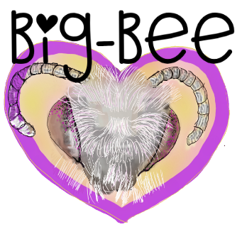

## Darwin Core Mapping for Bee Biodiversity Data
# Native bee biodiversity data management workshop

Instructors: Deborah Paul, Katja C. Seltmann
  28 March 2023, 10:00 pm - 2:00 pm PST via Zoom
  28 March 2023, 10:00 pm - 2:00 pm PST via Zoom

A introductory Darwin Core mapping exercise using bee monitoring and biodiversity datasets.

## Acknowledgements
A special thanks to the following organizations and projects that made this work and tutorial possible:
[NSF](https://nsf.gov) for their support and funding of [Big-Bee](https://www.idigbio.org/wiki/index.php?title=TCN:_Extending_Anthophila_research_through_image_and_trait_digitization_(Big-Bee)&mobileaction=toggle_view_desktop), Extending Anthophila research through image and trait digitilization. ([NSF:DBI:2102006](https://www.nsf.gov/awardsearch/showAward?AWD_ID=2102006&HistoricalAwards=false)), Taxon Works [https://taxonworks.org/](https://taxonworks.org/), [National Bee Monitoring RCN](https://www.nativebeemonitoring.org)

 

 

